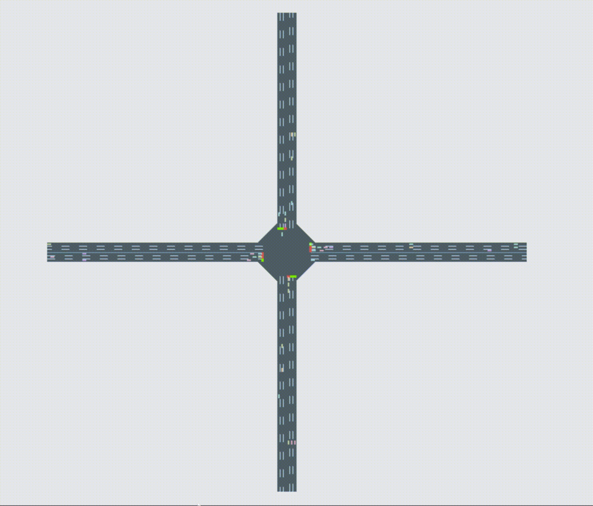

# SmartCommute
Making your commute faster @ HackWestern 2019

## Inspiration
We wanted to create a project that could help improve multiple aspects of society at once, while still being a simple and *practical* implementation, where the results can be understood by people who are not experts in technology. We believe we can help the City of London by showing, from period to period, what alterations need to be made in the traffic lights to help increase the flow of traffic, *decrease commute times*, improve the economy and decrease *emissions*.

## What it does
Our algorithm runs in a simulation and learns, through AI, how to *optimize the intervals* of the traffic lights to decrease the average number of cars stopped at any given point in the simulation.

We picked an intersection next to where we live (*Oxford St W & Wharncliffe Rd N*) and used data from the *City of London Open Data* website to populate and try to simulate the intersection and flows. The Traffic Volume data was especially helpful. Also, we believe the similarity is fairly high, considering we had limited hours. 

Average number of cars stopped at any given time *before* optimizing: 3.22088 (first gif)
Average number of cars stopped at any given time *after* optimizing: 1.653533 (second gif)
Improvement: about *96.9%*.

## How I built it
We used and modified an open-source implementation of the simulator, called CityFlow, using a docker container. There, we create our own model for an intersection similar to the one we live nearby. 
The optimizer and gradients were created in python using machine learning (scikit-learn) using auxiliary libraries from calculating gradients.

## Challenges I ran into
Creating the *reinforcement learning model* was definitely the hardest challenge. We didn't have that much experience so we struggled. But in the end, we manage to create a solution that worked, so we are proud of that.

## Accomplishments that I'm proud of
We are proud of having finished a hack that can be used in real life by cities.

## What I learned
We learned how to use docker, improve our c++ and python knowledge, and had fun working as a team.

## What's next for SmartCommute
We plan on making our simulations bigger, more realistic, and improving our reinforcement learning algorithm so it learns better.
Our vision was to be able to provide automated *monthly traffic advice* to the City of London on how to improve the traffic lights, *at a low cost*, without having to add additional hardware to the traffic lights.

Sincerely,
Caio and Matthew

## Videos
#### Before

#### After

